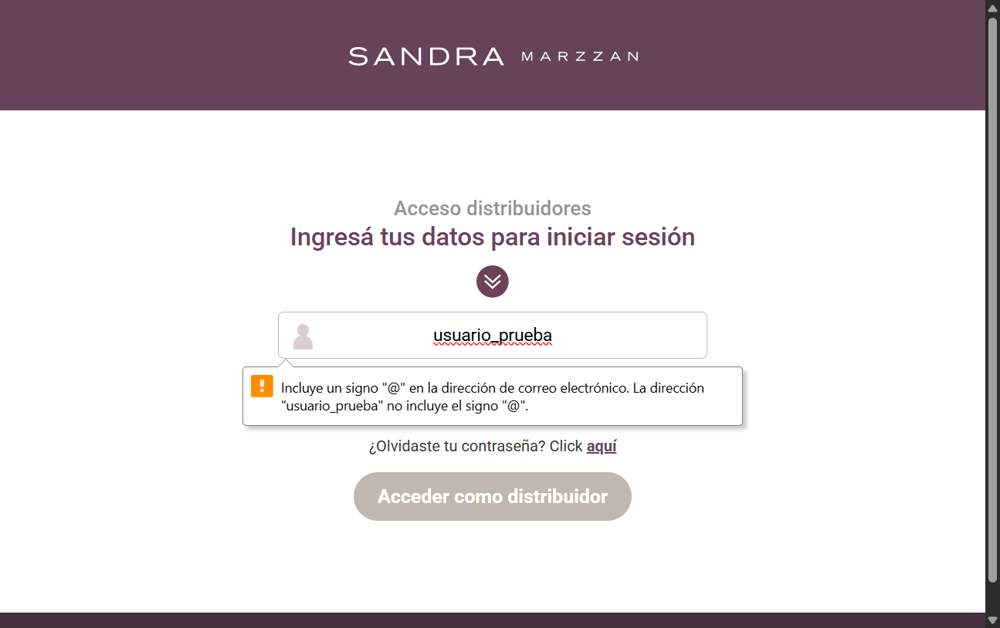

# 🧪 Test Automatizado: Login de Distribuidores Sandra Marzzan

Este proyecto automatiza el flujo de login del sitio de distribuidores de Sandra Marzzan utilizando Python y Selenium WebDriver.

---

## 🔍 Objetivo

Verificar que el formulario de acceso de la web funcione correctamente al ingresar un usuario y contraseña de prueba.

---

## 🛠️ Herramientas utilizadas

- Lenguaje: Python
- Librería: Selenium WebDriver
- Navegador: Google Chrome
- Driver: ChromeDriver

---

## 📝 Caso de prueba

| Elemento        | Detalle |
|-----------------|---------|
| **Nombre**      | Test de login básico |
| **ID**          | TC-001 |
| **Descripción** | Validar la carga de la página de login y simular el envío del formulario con datos ficticios |
| **Datos de prueba** | Usuario: `usuario_prueba`<br>Contraseña: `clave_prueba` |
| **Resultado esperado** | El formulario se envía y la página responde (sin errores de carga) |
| **Resultado obtenido** | 🟢 El navegador abrió, se completaron los campos, se hizo clic y se tomó una captura de pantalla correctamente |

---

## 📸 Evidencia



---

## 🚀 Cómo ejecutar el test

1. Clonar el repositorio.
2. Instalar Selenium:  
   ```bash
   pip install selenium
